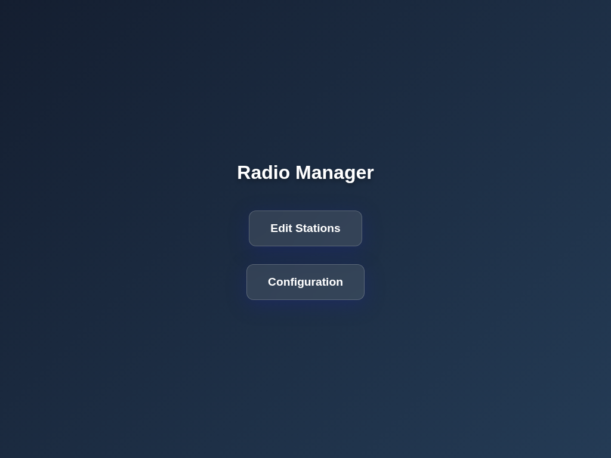
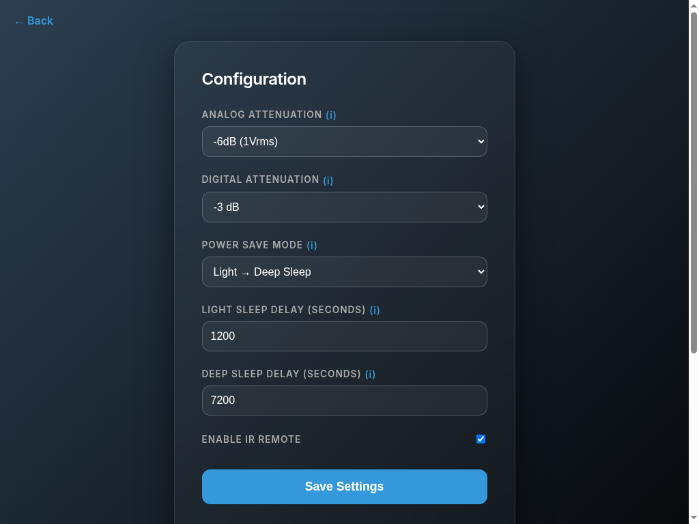
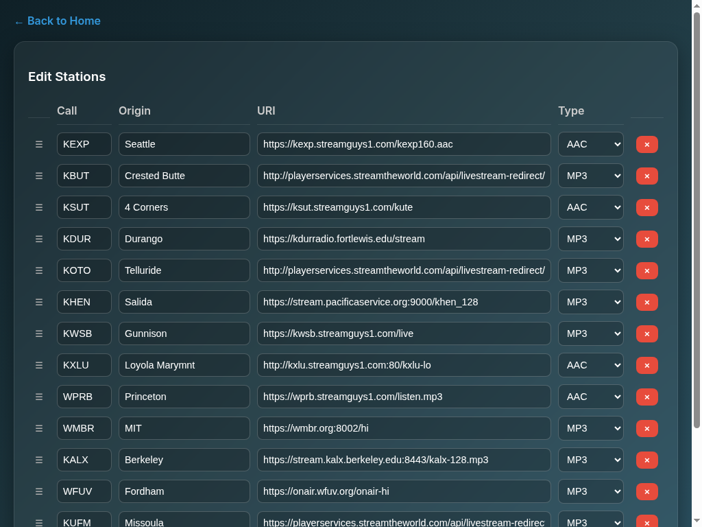
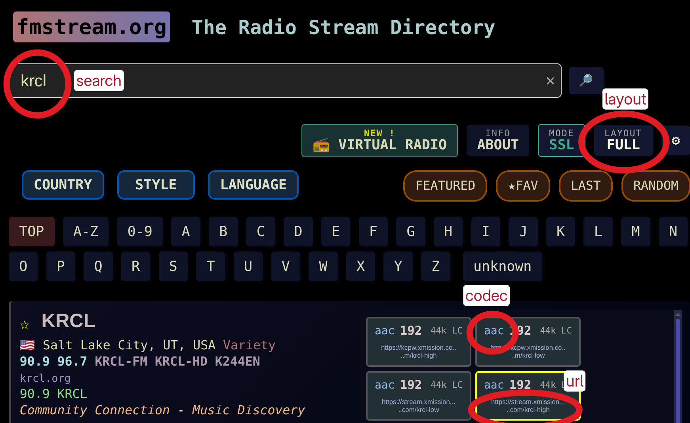

# Internet Radio User Manual

Welcome to your new Internet Radio! This manual will guide you through the initial setup, daily operation, and advanced configuration of your device.

## Note: Converting user manual markdown to pdf

```bash
pandoc user_manual.md -o user_manual.pdf --pdf-engine=typst -V mainfont="Libertinus Serif"
```

## 1. Initial Setup and Wi-Fi Provisioning

When you first power on the radio, it will not know how to connect to your local Wi-Fi network. It will enter "Provisioning Mode" to allow you to securely provide these credentials.

### What You Will See

The radio's display will show a message indicating it is waiting to be provisioned. To connect it to your network, you will need to use a smartphone application provided by Espressif.

### Step-by-Step Provisioning Guide

1. **Download the App**: Download the **ESP BLE Provisioning** app from the Apple App Store or Google Play Store.
2. **Start Provisioning**: Open the app and tap **"Provision Device"**.
3. **Bypass QR Code**:  This device does not use a QR code for pairing.  Instead, the device will broadcast its name (agk radio) and MAC address via Bluetooth Low Energy (BLE).  Select the agk radio:<mac-address> from the list of discovered devices.
4. **Scan for Wi-Fi**: Once connected via Bluetooth, the app will scan for available Wi-Fi networks in your area.
5. **Enter Credentials**: Select your Wi-Fi network (2.4GHz) from the list and enter your Wi-Fi password.
6. **Complete Setup**: The app will send the credentials to the radio. The app will display "Provisioning Successful," and the radio will connect to the internet.
7. **Ready to Play**: The radio's screen will briefly display its newly acquired IP address and then begin playing the default internet radio stream.

*Note: If you ever change your Wi-Fi router or password, you can force the radio back into this Provisioning Mode by pressing and holding the Volume knob while powering on or resetting the device.*

## 2. Operating the Radio

The radio is controlled entirely using two rotary knobs. Both knobs can be turned and pushed in like a button.

### Volume Control

* **Turn**: Adjusts the volume from 0 to 100. If the radio is currently muted, turning the knob will automatically unmute the audio and adjust the volume.
* **Single Click**: Toggles the audio mute on and off. If the radio has entered its "Light Sleep" power-saving mode (where the screen turns off), a single click will wake it up and unmute the audio.
* **Double Click**: If you are using the radio an Infrared (IR) signal to toggle the power on an attached receiver if configured to do so.
* **Hold at Boot**: As mentioned above, holding this button while the radio powers on will erase saved Wi-Fi credentials and start Provisioning Mode.

### Station Selection

* **Turn**: Scrolls through your list of saved radio stations. The screen will switch to a "Roller" view. Once you find the station you want, simply stop turning. After 2 seconds of inactivity, the radio will automatically select the new station and begin playing.
* **Short Press**:
  * Displays the radio's current **IP Address** on the screen for 3 seconds. You will need this address to access the web configuration.
  * If the radio is muted or sleeping, a short press acts as a **"Wake"** button to restore audio and power on the screen. This button is also capable of waking the radio from "Deep Sleep."
* **Long Press**: Holding this button for more than 1.5 seconds will reboot the radio.

### Power Management

To save energy, the radio can automatically enter sleep states if it is muted and left inactive. The behavior depends on your configured Power Save Mode:

* **None**: No power savings. The radio remains fully active (~190mA, costing ~$1.25/year).
* **Light Sleep Only**: After a period of inactivity, the screen turns off to save power, but the radio remains connected to Wi-Fi. Pressing either knob will wake it up (~18mA, costing ~$0.12/year).
* **Light -> Deep Sleep**: After an extended period in Light Sleep, the radio powers down almost completely. Pressing the Station knob will wake the device and perform a fresh boot (~8mA, costing ~$0.05/year).

## 3. Web Interface Configuration

You can configure advanced settings and manage your saved radio stations using the built-in web interface.



To access the interface, find the radio's IP address (by short-pressing the Station knob) and type it into the web browser of a computer or smartphone connected to the same Wi-Fi network. For example: `http://192.168.1.100`

### Device Configuration



Navigate to the device configuration page (e.g., `http://<IP_ADDRESS>/config`) to adjust system settings:

* **Analog/Digital Attenuation**: These settings allow you to fine-tune the audio output levels to balance the gain of your external speakers or amplifier with the output of the internet radio. It is highly recommended to use **Analog Attenuation** first, as this preserves the full bit depth (and therefore the quality) of the audio signal. If the output is still too loud after applying analog attenuation, you can apply additional reduction using **Digital Attenuation**.
* **Power Save Mode**: Choose your preferred power savings strategy: **None** (always on), **Light Sleep Only** (turns off screen), or **Light -> Deep Sleep** (turns off screen, then fully powers down).
* **Sleep Delays**: Configure exactly how many seconds the radio should wait while muted before entering Light Sleep, and how long it should wait in Light Sleep before entering Deep Sleep.
* **IR Remote**: Enable or disable the IR transmitter used to control external Bose systems.

### Station Configuration



Navigate to the station configuration page to manage your radio dial. From this page you can:

* **Add New Stations**: Enter the Name, Stream URI, and select the appropriate audio codec (MP3, AAC, OGG, or FLAC).
* **Edit/Remove Stations**: Update existing stream URLs if they change, or delete stations you no longer listen to using the "**x**" button.
* **Reorder**: Change the order in which stations appear when you turn the Station knob by **dragging** the rows up or down.

Changes made on the station configuration page are saved permanently, but the radio may need to be rebooted to apply the new list to the main interface.

## 4. Finding Radio Streams

If you want to add a new station, you will need its direct audio stream URL. Standard website URLs (like `npr.org`) will not work directly.

The easiest way to find compatible stream URLs is to use **[fmstream.org](https://fmstream.org)**.

1. Search for your desired radio station on the site (for example, "KEXP").
1. Set layout to *FULL*.
2. Look for the direct streaming links provided in the search results. Next to each URL, you will see the **format/codec** (e.g., MP3, AAC) and the bitrate (e.g., 128 kbps).
3. Copy the URL that corresponds to the format you want (typically ending in `.mp3` or `.aac`), and paste it into your radio's Station Configuration page.



1. In the radio's configuration, select the exact codec (MP3, AAC, etc.) that was listed next to the URL on the fmstream website.
2. Use *origin* to help describe the station.  You have about 14 characters available on the display.
